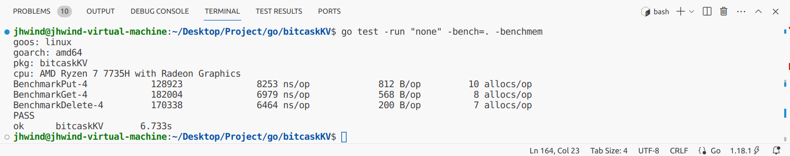
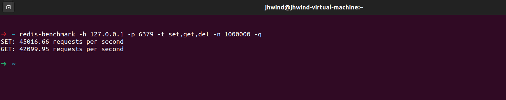
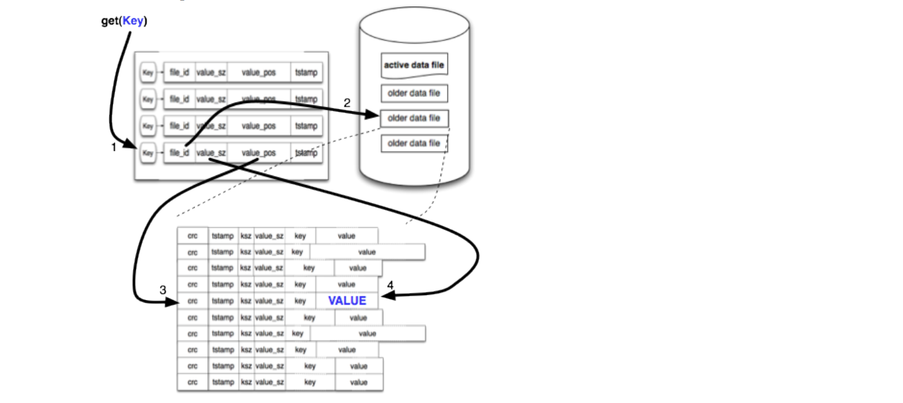
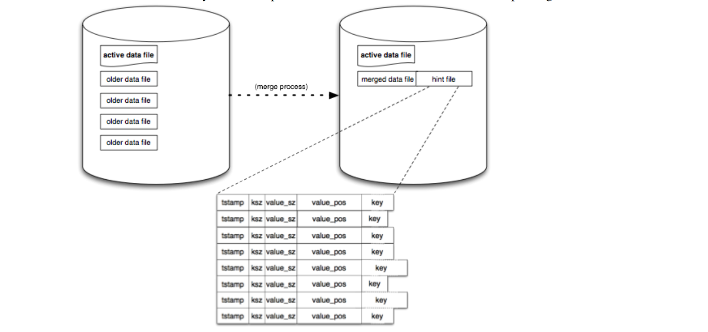

## 测试

对比测试，读写性能均达到 12w+，与 redis 同一数量级





## 架构



### 数据文件

hint + older data file + active data file

```c++
// DataFile 数据文件
type DataFile struct {
	FileId    uint32        // 文件id
	WriteOff  int64         // 文件写入到哪个位置了
	IoManager fio.IOManager // io 读写管理
}
```


### 磁盘数据格式


去除 tstamp 增加数据类型 type 标识

```c++
//	+-------------+-------------+-------------+--------------+-------------+--------------+
//	| crc 校验值  |  type 类型   |    key size |   value size |      key    |      value   |
//	+-------------+-------------+-------------+--------------+-------------+--------------+
//	    4字节          1字节        变长（最大5）   变长（最大5）     变长           变长
// LogRecord 的头部信息
type LogRecordHeader struct {
	crc        uint32
	recordType LogRecordType
	keySize    uint32
	valueSize  uint32
}
type LogRecord struct {
	Key   []byte
	Value []byte
	Type  LogRecordType
}
```

### 内存索引数据格式


```c++
// 内存索引中 存放的信息，表示数据的位置
// Fid 哪个数据文件 Offset 数据文件中的偏移
type LogRecordPos struct {
	Fid    uint32
	Offset int64  // 是磁盘数据记录开头的位置
	Size   uint32 // 标识数据在磁盘上的大小
}
```

### hint 数据格式

同内存索引数据格式

### 操作

|        |                                                              |
| ------ | ------------------------------------------------------------ |
| put    | 先写磁盘，再写内存                                           |
| get    | 根据 key 从内存索引获取 LogRecordPos，从 active/old file 根据 offset 读取 LogRecordHeader，再根据 header 的 key/val size 读取 value。对于 LogRecordHeader 中的 key/val size 是采用的动态编码 |
| delete | 追加写记录标记为删除，然后更新内存，后续 merge 再清理无效数据 |

### Merge



生成 merge 

1. 查看可以 merge 的数据量是否达到了阈值，查看剩余的空间容量是否可以容纳 merge 之后的数据量
2. 持久化当前活跃文件，将当前活跃文件转换为旧的数据文件
3. 记录最近没有参与 merge 的文件 id
4. 取出所有需要 merge 的文件；待 merge 的文件从小到大进行排序，依次 merge；如果目录存在，说明发生过 merge，将其删除掉
5. 新建一个 merge path 的目录，打开一个新的临时 bitcask 实例
6. 遍历处理每个数据文件的每条记录，和内存中的索引位置进行比较，如果有效则重写，同时将当前位置索引写到 Hint 文件当中
7. sync 保证持久化，写标识 merge 完成的文件，只有存在 merge 标识完成的文件才能保证 merge 顺利完成

加载 merge

1. 查找标识 merge 完成的文件，判断 merge 是否处理完了
2. 删除旧的数据文件，将新的数据文件移动到数据目录中

### WriteBatch

- Put：暂存 LogRecord
- Delete：如果数据在内存中存在，暂存一个标记 key 的 val type 为 delete 的数据
- Commit：获取当前最新的事务序列号；开始写数据到数据文件当中，写一条标识事务完成提交的数据，保证原子性的关键；根据配置决定是否持久化；更新内存索引


